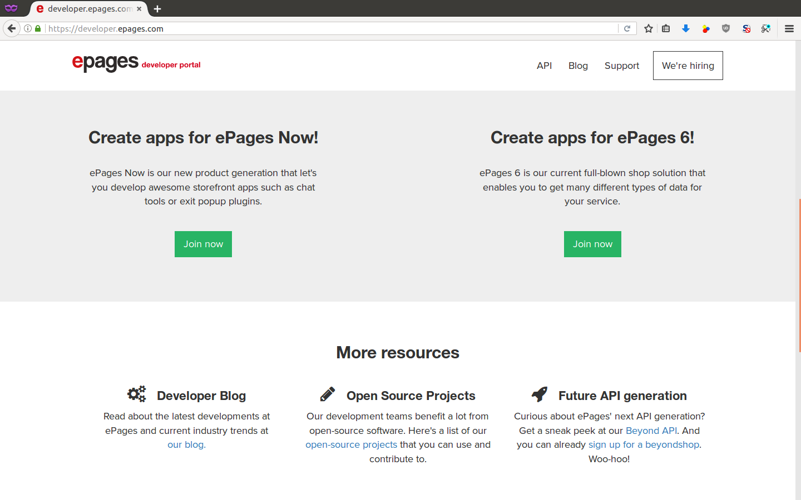
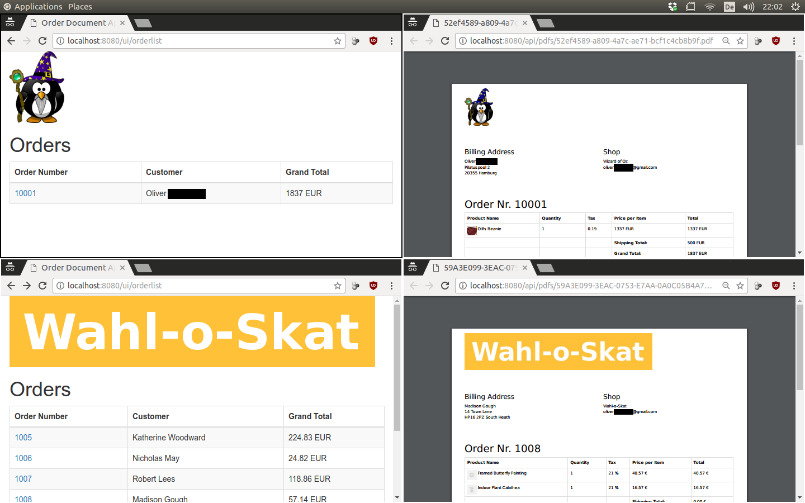
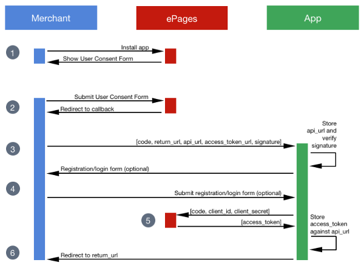
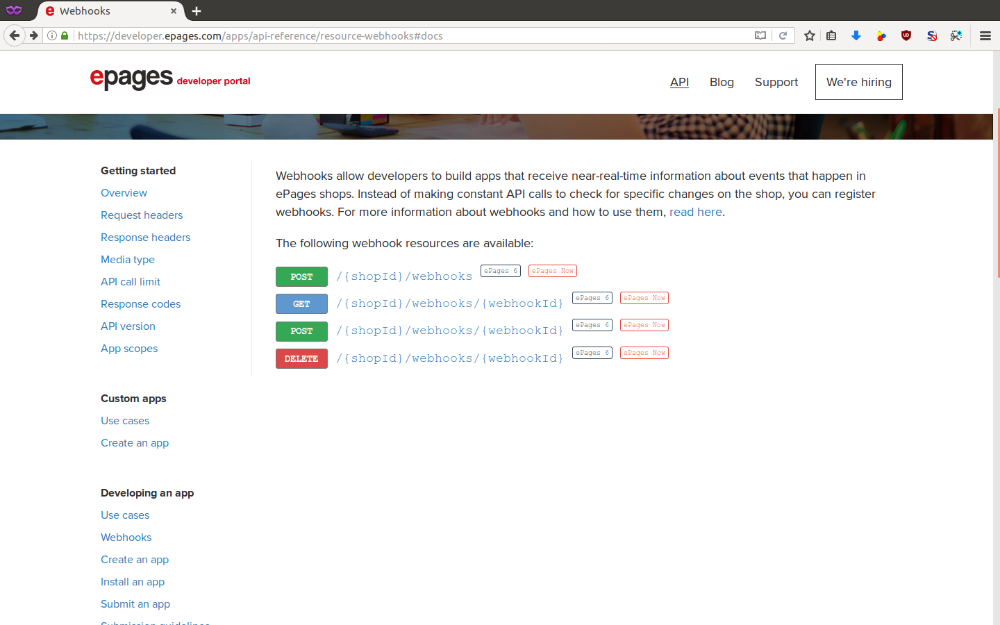

<!-- .slide: data-background="./33.jpg" -->

<h1>Live-coding</h1>

<b>
Oliver Zscheyge 
Software Engineer 
[@oozgo](https://twitter.com/oozgo) 
[github.com/ooz](https://github.com/ooz) 
[o.zscheyge@epages.com](mailto:o.zscheyge@epages.com) 
 
Commerce Summit 
Hamburg, 2017-09-21
</b>

---

## Getting an ePages dev shop

---

## ePages REST API differences

||Base/Now|Now&Beyond|
|---|---|---|---|
|**Auth**|perm. access token|expiring JWT + refresh|
|**Compatibility**|Now ~ Base|new API|
|**Features**|private apps, installation test, app store, webhooks|private apps, rest planned|

---

## Order Document App

---

## OAuth 2.0 flow for app installation

---

## Webhooks

---

## ♥ Thank You! ♥

* [https://github.com/ooz/epages-rest-python](https://github.com/ooz/epages-rest-python)
* [https://github.com/ooz/epages-rest-python-examples](https://github.com/ooz/epages-rest-python-examples/tree/master/beautiful_order_documents)
